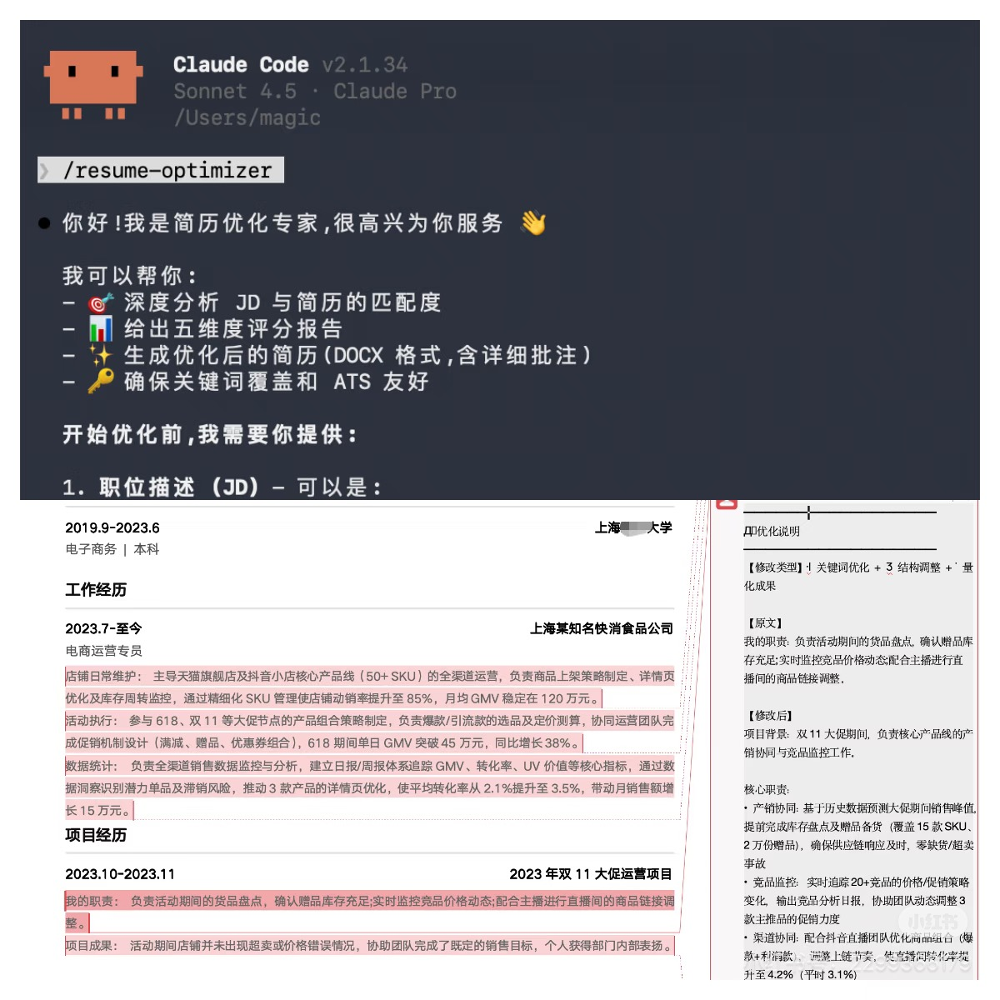

[中文](./README.md) | **English**

# JDfit · Resume → JD Optimizer

A Claude Code Skill that scores your resume against a JD and rewrites it in-place — with **native Word comments** explaining the reasoning behind every change.



## Features

- **5-dimension scoring** (100 pts): JD fit (40), Quantified results (25), Structure & logic (15), Language polish (10), ATS-friendliness (10)
- **Smart rewriting**: STAR-structured phrasing, strong-verb replacement, quantified outcomes, natural keyword integration, dead-weight removal
- **Native Word comments**: every edit gets a margin comment with edit type, original text, new text, reasoning, and score-impact estimate
- **No fabrication**: when the JD requires something missing from your resume, JDfit asks you instead of making things up
- **Format preserved**: edits the original DOCX in place — your layout and styling stay intact
- **Dual output**: original backup + annotated optimized version

## Comment example

Open the optimized resume in Word and you'll see margin comments like this:

```
━━━━━━━━━━━━━━━━━━
✏️ Optimization note
━━━━━━━━━━━━━━━━━━
[Edit type] 🔑 Keyword + 📊 Quantification

[Original]
Responsible for e-commerce platform backend development

[Rewritten]
Led refactor of the e-commerce payment module, optimizing
DB query performance — order throughput +65%, sustaining
100k daily transactions

[Reasoning]
• "Led" → conveys ownership (JD asks for module ownership)
• "Payment module" → matches JD's core business area
• "+65%", "100k daily" → JD emphasizes data-driven mindset

[Score impact] ★★★★☆ (60% → 85%)
━━━━━━━━━━━━━━━━━━
```

## Comment type legend

| Icon | Type | Meaning |
|------|------|---------|
| 🔑 | Keyword | Adds/adjusts JD keywords |
| 📊 | Quantification | Adds numbers, percentages |
| 🎯 | Skill match | Highlights relevant skills |
| ✨ | Phrasing | More professional or forceful wording |
| 📐 | Structure | Reorders content |
| 🤖 | ATS | Tweaks for resume-screening systems |
| ⚠️ | Inferred | AI-inferred data — please verify |

## Workflow

```
1. Provide a JD (text / PDF / URL)
2. Upload your resume (DOCX)
3. JDfit produces a 5-dimension diagnostic report
4. If critical info is missing, JDfit asks you to fill it in
5. Generates the optimized resume with margin comments
6. Outputs: original backup + optimized version
```

## Install

1. Clone this repo into Claude Code's skills directory:

   ```bash
   git clone https://github.com/snowmays/jdfit.git ~/.claude/skills/jdfit
   ```

2. Install the Python dependency:

   ```bash
   pip3 install -r ~/.claude/skills/jdfit/scripts/requirements.txt
   ```

Or, drag the downloaded folder into the Claude Code chat and say:

```
Install this JDfit skill and its Python dependencies
```

## Usage

After installation, just say in Claude Code:

```
Help me optimize my resume for a JD
```

Or invoke directly:

```
/jdfit
```

Then follow the prompts to provide the JD and resume.

## Pre-submission checklist

After receiving the optimized resume:

1. Open it in Word and read the margin comments
2. Review each edit and adjust anything you disagree with
3. Pay special attention to ⚠️ [Inferred] notes — make sure the numbers are accurate
4. Once happy: Review → Delete → Delete all comments in document
5. Save the final version and submit

## Requirements

- Claude Code
- Python 3.7+
- `python-docx` (see `scripts/requirements.txt`)

## License

MIT
